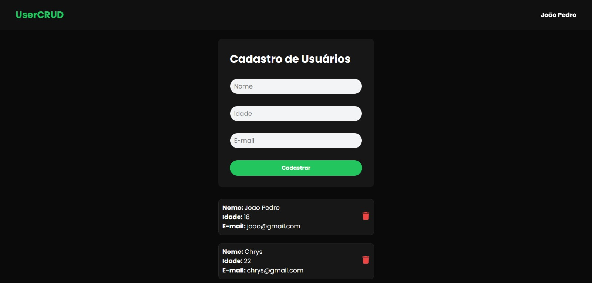

# 🚀 User CRUD API

Aplicação Full Stack de cadastro de usuários desenvolvida utilizando tecnologias modernas do ecossistema JavaScript.

O projeto consiste em uma API REST integrada com um frontend em React para realizar operações de CRUD de usuários com persistência de dados no MongoDB.

---

# 📸 Preview



---

# ✨ Funcionalidades

✅ Criar usuários  
✅ Listar usuários  
✅ Deletar usuários  
✅ Integração com MongoDB Atlas  
✅ API REST completa  
✅ Interface moderna em Dark Mode  
✅ Atualização dinâmica em tempo real  

---

# 🌐 Tecnologias

## Frontend
<p>
  
</p>

## Backend
<p>
  
</p>

## Banco de Dados
<p>
  
</p>

---

# ⚙️ Arquitetura do Projeto

## 🔹 Frontend
Responsável pela interface do usuário, renderização dos dados e consumo da API.

## 🔹 Backend
API REST construída com Express.js responsável pelas operações CRUD.

## 🔹 Banco de Dados
MongoDB Atlas integrado utilizando Prisma ORM.

---

# 📌 Endpoints da API

## Buscar usuários

```http
GET /users
```

## Criar usuário

```http
POST /users
```

## Deletar usuário

```http
DELETE /users/:id
```

---

# 📦 Instalação

## Clone o repositório

```bash
git clone https://github.com/seu-github/user-crud.git
```

---

# 🔥 Rodando o Backend

```bash
cd backend
npm install
```

Crie um arquivo `.env`:

```env
DATABASE_URL="sua_url_mongodb"
```

Execute:

```bash
npx prisma generate
npm run dev
```

---

# 💻 Rodando o Frontend

```bash
cd frontend
npm install
npm run dev
```

---

# 🧠 Conceitos praticados

- CRUD completo
- APIs REST
- Integração Frontend ↔ Backend
- React Hooks
- Consumo de API com Axios
- MongoDB
- Prisma ORM
- Componentização
- Manipulação de estado
- Estilização moderna com CSS

---

# 👨‍💻 Desenvolvido por

### João Pedro

🔗 GitHub: https://github.com/jotap-tech
